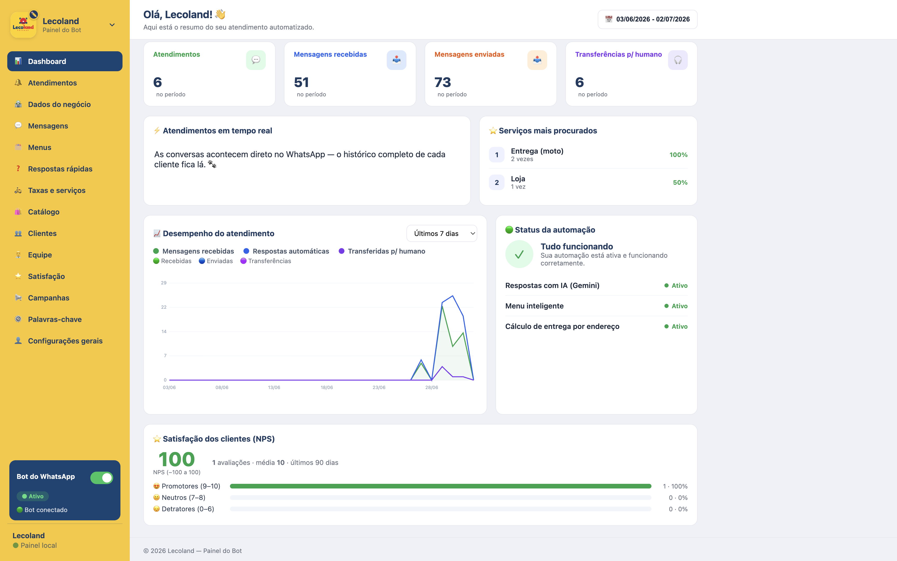
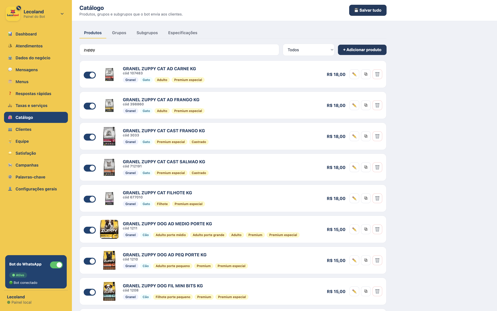

# Gestalize Bots

AI-assisted customer service automation for WhatsApp, built for pet retail and veterinary businesses.

## Overview

Gestalize Bots is a conversational customer service platform that automates first-line support on WhatsApp. It answers customer inquiries in natural language, quotes deliveries, searches the product catalog, and routes complex requests to human staff. A web-based administration panel allows non-technical operators to manage every part of the experience — business information, menus, pricing, catalog, and knowledge base — without writing code.

The platform is designed to operate as an always-available assistant that resolves routine questions instantly while preserving a seamless path to human attention when it matters.

## Business Problem

Pet shops and veterinary clinics receive a continuous stream of repetitive messages: opening hours, product prices and availability, delivery quotes, service details, and appointment requests. Handling these manually is slow and inconsistent, occupies staff who could be assisting customers in person, and leaves messages unanswered outside business hours. The result is longer response times, lost sales, and an uneven customer experience.

## Solution

Gestalize Bots provides an automated first line of support that responds instantly to common inquiries and escalates to a human operator only when necessary. Responses are grounded strictly in the business's own data, so the assistant does not invent prices, services, or availability. When a conversation requires human involvement, it is transferred with an automatically generated summary, allowing staff to continue without re-reading the full exchange.

Because the entire experience is managed through a web panel, the business can adapt messages, pricing, catalog, and rules on its own and in real time.

## Key Features

- Natural-language responses grounded in the business's configured data
- Keyword-based triage and guided, numbered menus
- Product catalog with search and image-based responses
- Delivery and pickup fee estimation based on customer address
- Customer records with pets, funnel stages, tags, and internal notes
- Intelligent human handoff with automatically generated conversation summaries
- Voice message transcription and document reading
- Product recognition from customer-submitted images
- Customer satisfaction surveys with reporting
- Broadcast campaigns to segmented audiences
- Operational metrics dashboard
- Business-hours and holiday awareness
- Team directory recognition
- Complete web administration panel, no code required

## Architecture Overview

The platform runs as a single service with two responsibilities: an inbound messaging webhook and a secured web administration panel.

Incoming messages pass through a conversation engine that first attempts deterministic resolution through keyword triage and guided menus. Open-ended questions are delegated to the AI layer, which is constrained to the business's configured knowledge and catalog and can invoke internal capabilities such as delivery estimation and catalog search. When a request exceeds automated handling, the conversation is handed to a human operator together with a concise, automatically generated summary.

Conversation logic is intentionally decoupled from the messaging transport, keeping business behavior independent of the underlying channel. All customer-facing content and operational rules are defined through the administration panel.

## Technology Stack

| Layer | Technology |
| --- | --- |
| Runtime | Node.js |
| Web framework | Express |
| Messaging | WhatsApp Cloud API |
| Natural language | Google Gemini |
| Geolocation and routing | OpenRouteService |
| Administration panel | Server-rendered HTML, CSS, and JavaScript |
| Persistence | File-based structured storage |

## Project Structure

At a high level, the codebase is organized into cohesive modules:

- Messaging integration — inbound webhook handling and outbound message delivery
- Conversation engine — triage, menus, dialog state, and human handoff
- AI service — grounded responses, catalog search, transcription, and document reading
- Administration panel — configuration interface and management endpoints
- Data layer — business configuration, product catalog, customer records, and analytics

## Screenshots

## Future Improvements

- Multi-language support
- Shared multi-agent inbox with assignment and routing
- Expanded analytics and reporting
- Additional third-party integrations
- Role-based access control for larger teams

## License

Gestalize Bots is proprietary software developed and maintained by Gestalize Systems. All rights reserved.
