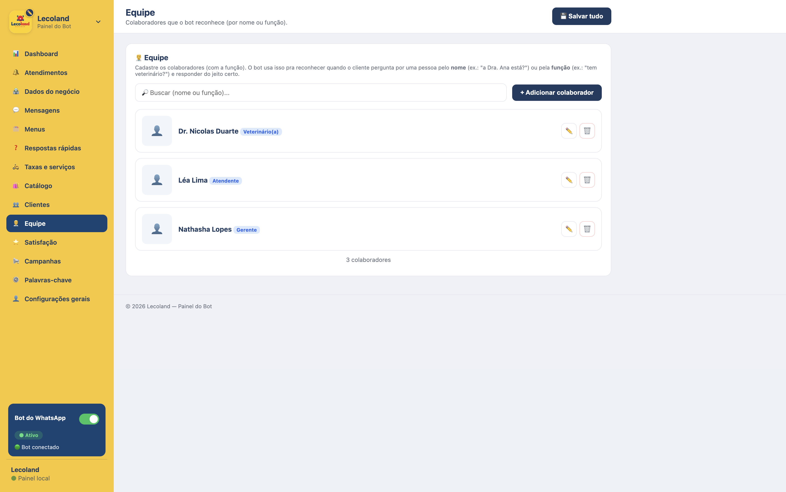
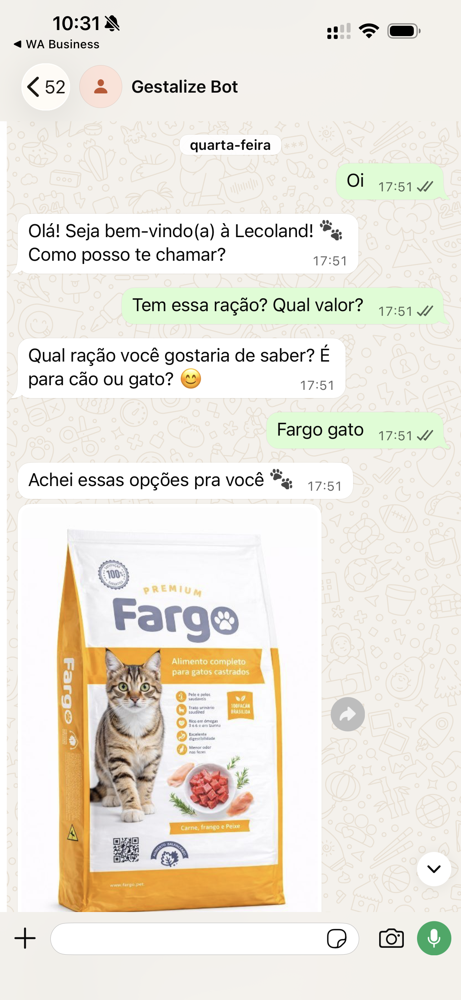

  

<h1 align="center">Gestalize Bots</h1>

  AI-Powered WhatsApp Business Platform

  Automate conversations, customer service, sales and business workflows using AI.

  
  
  
  
  

  <a href="https://gestalizesystems.com.br">Website</a> •
  <a href="https://instagram.com/gestalizesystems">Instagram</a>

 

  Developed by <strong>Gestalize Systems</strong>

---

## Overview

Gestalize Bots is an AI-powered WhatsApp automation platform that enables businesses to automate customer communication, streamline support, qualify leads, manage conversations and integrate intelligent workflows into their daily operations.

Designed for organizations of all sizes, the platform combines conversational AI, business automation and a configurable administration panel, enabling organizations to configure conversations, workflows and business knowledge without writing code.

## Use Cases

Gestalize Bots can be adapted to a wide range of industries, including:

- Retail & E-commerce
- Healthcare
- Veterinary Clinics
- Restaurants
- Professional Services
- Education
- Real Estate
- Customer Support
- Internal Business Operations

## Business Problem

Businesses receive a high volume of repetitive customer requests every day through WhatsApp.

Questions about products, services, appointments, pricing, availability and support consume valuable staff time, increase response delays and often result in inconsistent customer experiences.

As organizations grow, maintaining fast, personalized and scalable communication becomes increasingly difficult without automation.

## Solution

Gestalize Bots provides an intelligent automation layer for WhatsApp that handles routine conversations, retrieves organization-specific knowledge, executes predefined workflows and escalates complex requests to human operators whenever necessary.

The platform combines AI-powered conversations with configurable business rules, ensuring responses remain accurate, consistent and aligned with each organization's data and processes.

## Key Features

### AI

- Natural-language conversations
- Voice and document understanding
- AI-powered image analysis

### Customer Engagement

- Audience segmentation
- Broadcast campaigns
- Customer satisfaction surveys

### Business Operations

- CRM
- Catalog and service management
- Smart team routing
- Operational dashboard

## Architecture Overview

Gestalize Bots is built around a modular architecture that separates messaging, business logic, artificial intelligence and administration into independent layers.

Incoming WhatsApp conversations are processed by the conversation engine, which combines configurable business rules with AI-powered responses to deliver accurate, context-aware interactions. When a request requires human intervention, the platform seamlessly transfers the conversation while preserving its context.

The administration panel allows organizations to manage business information, knowledge bases, products, services, workflows and AI behavior through an intuitive interface, eliminating the need for direct code changes.

This architecture enables the platform to remain scalable, maintainable and adaptable to different industries while keeping communication channels independent from the core business logic.

## Technology Stack

| Layer | Technology |
| --- | --- |
| Runtime | Node.js |
| Web framework | Express |
| Messaging | WhatsApp Cloud API |
| Natural language | Google Gemini |
| Geolocation and routing | OpenRouteService |
| Administration panel | Server-rendered HTML, CSS, and JavaScript |

## Platform Modules

- Messaging Layer
- AI Engine
- Administration Panel
- Business Logic
- Data Management

## Screenshots

  
   
  <b>Administration dashboard</b>

<table>
  <tr>
    <td width="50%" align="center" valign="top">
      
       
      <b>Product catalog</b>
    </td>
    <td width="50%" align="center" valign="top">
      
       
      <b>Team management</b>
    </td>
  </tr>
</table>

  
   
  <b>WhatsApp conversation</b>

## Future Improvements

- Multi-language support
- Shared multi-agent inbox with assignment and routing
- Expanded analytics and reporting
- Additional third-party integrations
- Role-based access control for larger teams
- Multi-channel messaging support

## License

Gestalize Bots is proprietary software developed and maintained by Gestalize Systems. All rights reserved.
